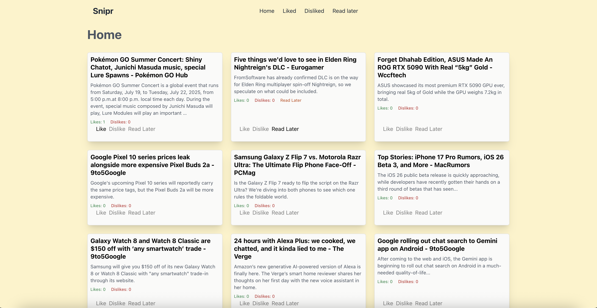
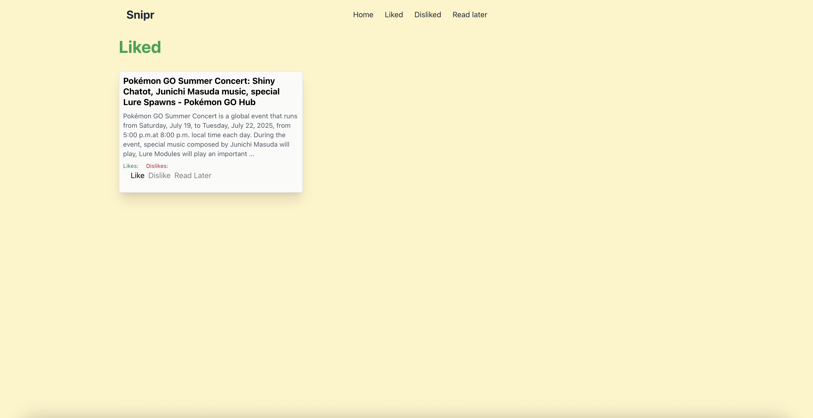
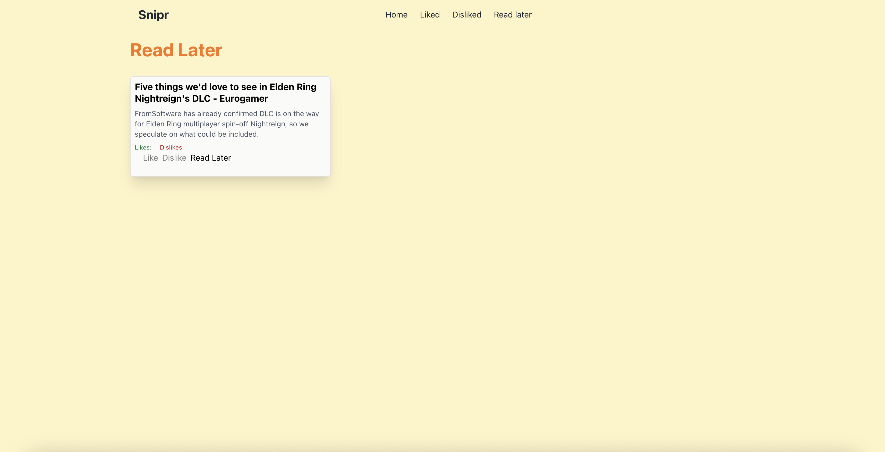

### Snipr – Snippets of Tech News

A local tech-news aggregator. Fetches today’s articles from the NewsAPI, stores them in PostgreSQL, and lets you like, dislike, or save for later.

### Prerequisites
- Node.js ≥ 14  
- npm ≥ 6  
- PostgreSQL (running & accessible)

### Installation

#### Server
1. Clone the repo  
   ```sh
   git clone https://github.com/matteggers/snipr.git

## Install dependencies

1. Server
```
  cd snipr/server/src
  npm install
```
2. Client
```
  cd snipr/client/src
  npm install
```

## Usage

```
  cd snipr/server/src
  npm run dev

In a separate terminal
  cd snipr/client/serc
  npm run start

```

Also need to setup your pg db and make an env file with the username, password, and db name for the backend to use. Save in format according to the db config file vars

### Architecture
* App starts and user is brought to home page
* DB queried for articles created today, if none available, fetch from NewsAPI. Save them in db, then query them and send to frontend.
* Client then displays articles and provides buttons for liking, disliking, and reading later. Buttons then alter number of likes and set read later to true if selected.

## Screenshots

### Home Page w/ Articles


### Likes Page


### Read Later



### Burnout
Although this project isn't massive, I realized I wouldn't actually use this tool. Although demotivated, I continued. Learned a lot about file structuring, making code modular so it doesn't break (look at first few commits, went with a monofile approach lol), querying to a database and errors that occur (server can still take duplicate articles from api and save them, my db has 750 rows and most are from the same api pull). Learned about routes and how single page applications work. Learned a lot about state management in React.
Intend on rewriting this, very tired right now.

Tech used: Node, PostgreSQL, React, TailwindCSS.


### Future features
* Web scrape the rest of the article to display the whole thing.
* Connect a local LLM to summarize it
* Search
* Model trained on my preferences and can highlight articles that I may like (even if they typically exist outside of my interests, which traditionally would become hidden)

For now, the project is not being actively developed. When I run out of other ideas I find more interesting, I may revisit this. If you are interested in further developing, fork it and shoot a PR my way. Thank you for reading this far.

There are currently multiple issues, including checking for duplicate articles before inserting into db, network errors that go away after refresh, and more. This is not my best work, but rather a rough introduction to web development and popular technologies used by others. 


